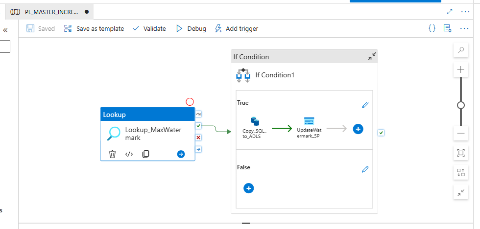
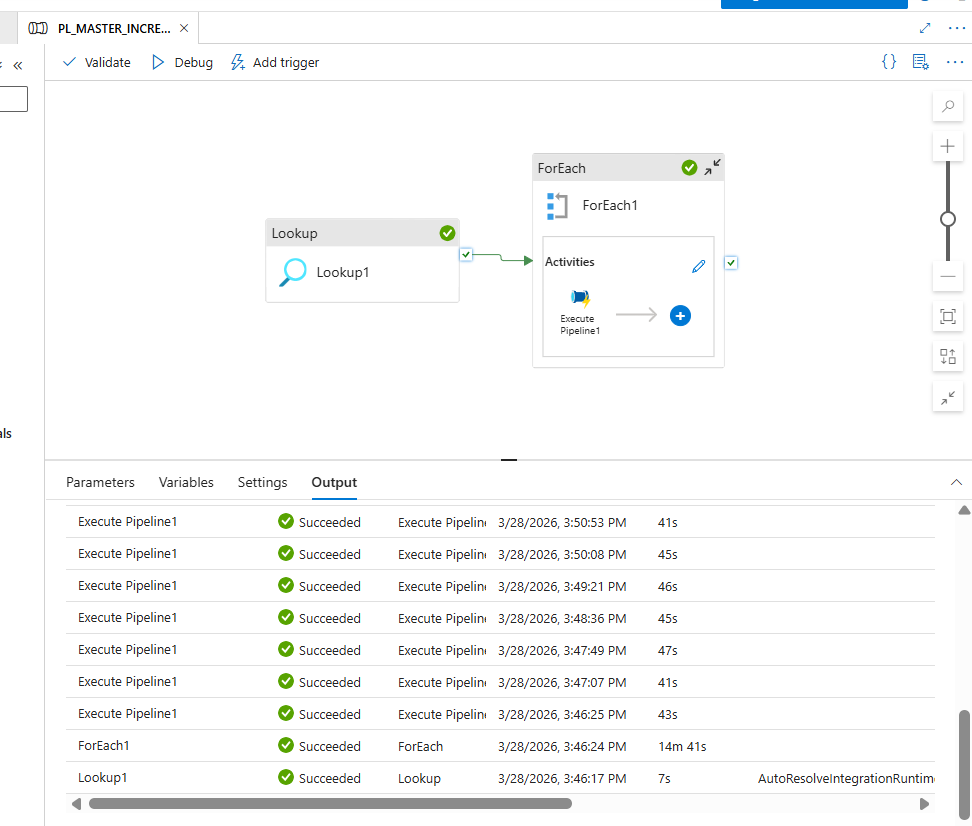

# Azure Data Factory Incremental ETL Pipeline

## Overview

This project demonstrates a **metadata-driven incremental ETL pipeline** built using **Azure Data Factory**.
The pipeline extracts data from **Azure SQL Database**, loads it into **Azure Data Lake Storage Gen2 (ADLS)** in **Parquet format**, and processes only new records using a **watermark table**.

---

## Technologies Used

* Azure Data Factory
* Azure SQL Database
* Azure Data Lake Storage Gen2
* GitHub

---

## Pipeline Architecture

The solution uses a **Master–Child pipeline architecture**.

### Master Pipeline

The Master Pipeline reads metadata from the watermark table and dynamically processes each table using a **ForEach activity**.

Steps:

* Lookup metadata from watermark table
* ForEach loop to iterate tables
* Execute child pipeline for each table

### Screenshot of Master Pipeline

(Add your **Master Pipeline screenshot here**)

---

## Incremental Load Logic

### Child Pipeline

The Child Pipeline performs incremental loading for each table.

Steps:

1. Lookup the maximum watermark value
2. Compare with the LastLoadValue in the watermark table
3. Copy new records from SQL to ADLS
4. Update watermark using stored procedure

### Screenshot of Child Pipeline

(Add your **Child Pipeline screenshot here**)

---

## Key Features

* Metadata-driven pipeline
* Incremental data loading using watermark logic
* Dynamic SQL query generation
* Automated watermark updates
* Data stored in Parquet format in ADLS

---

## Author

Sneha Thomas
